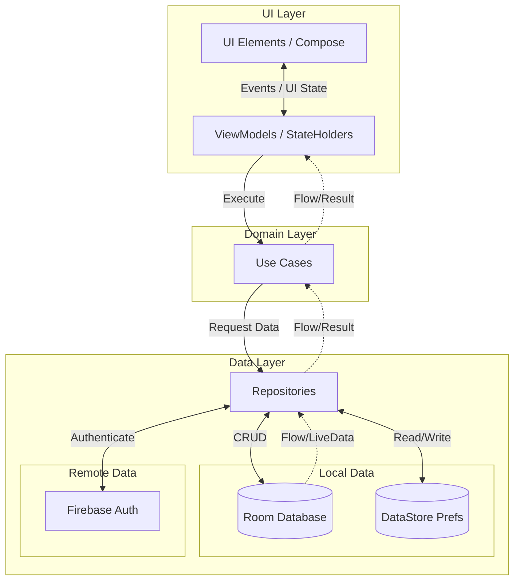

# Wedzy - Marriage Planner App

A comprehensive Android mobile application designed to help engaged couples plan, organize, and execute their wedding event seamlessly. Features complete user data isolation, secure authentication, and a rich set of planning tools.

## 🚀 Current Features (MVP - Phase 1 - COMPLETED)

### 🏠 Home Dashboard
- **Live wedding countdown** with days, hours, minutes, and seconds
- **Quick overview cards** showing Gallery, budget, guests, and vendors
- **Upcoming tasks display** with priority indicators
- **Custom hero background image** with persistent storage
- **Dynamic currency display** throughout the app
- **Authentication system** with Firebase Auth
- **User data isolation** - each account is completely separate

### ✅ Task Management
- **Complete CRUD operations** - Create, edit, and delete tasks
- **Priority levels** - Low, Medium, High with visual indicators
- **Task categories** - Venue, Catering, Photography, Decor, Transportation, etc.
- **Due date tracking** with overdue notifications
- **Task status filtering** - All, Pending, In Progress, Completed, Overdue
- **Task completion marking** with timestamp tracking
- **User-specific data** - tasks are isolated per user account

### 💰 Budget Tracker
- **Overall budget setting** and management
- **Category-based expense tracking** - Venue, Catering, Photography, etc.
- **Dual cost tracking** - Estimated vs. Actual costs
- **Payment status** - Not Paid, Partially Paid, Fully Paid
- **Budget progress visualization** with progress bars
- **Dynamic currency support** (USD, INR, etc.) with symbols
- **Real-time budget calculations** and remaining budget tracking
- **User-specific budgets** - complete isolation between accounts

### 👥 Guest List Management
- **Comprehensive guest profiles** - first name, last name, contact info
- **RSVP status tracking** - Pending, Invited, Confirmed, Declined
- **Guest side assignment** - Bride, Groom, Mutual
- **Plus-one management** with confirmation tracking
- **Dietary restrictions** and special notes
- **Table assignments** for seating management
- **Thank-you card tracking** for gifts received
- **Guest statistics** - confirmed attendees, plus-ones, etc.
- **User-specific guest lists** - complete privacy and isolation

### 🏪 Vendor Management
- **Vendor directory by category** - Photographer, Caterer, Venue, etc.
- **Smart category filtering** - vendors save to selected category automatically
- **Vendor status tracking** - Researching, Contacted, Proposal Received, Meeting Scheduled, Booked, Deposit Paid, Completed, Cancelled
- **Comprehensive pricing** - Quoted price, Agreed price, Deposit amount
- **Contact information** - Phone, Email, Website
- **Vendor notes and details**
- **Photo gallery integration** for vendor inspiration
- **Manual vendor addition** and contact picker integration
- **User-specific vendor lists** - isolated per account

### 🖼️ Gallery (Inspiration)
- **Personal photo gallery** for wedding inspiration
- **Category organization** - Venue, Decor, Flowers, Dress, Suit, Cake, Food, Drinks, Photography, Invitation, Hair/Makeup, Favors, Entertainment
- **Smart category filtering** - photos save to selected category automatically
- **Photo editing** - edit title, category, and notes for existing photos
- **Camera and gallery integration** for photo capture
- **Local photo storage** - images stored on device, not in cloud
- **Favorite marking** for preferred inspirations
- **Photo management** - add, edit, view, delete inspirations
- **User-specific galleries** - complete isolation between users

### 📅 Calendar & Events
- **Wedding event planning** with detailed timelines
- **Event categories** and custom event types
- **Date and time management**
- **Event descriptions and notes**
- **Calendar integration** for scheduling
- **User-specific events** - isolated per account

### 🔐 Security & Privacy Features

#### User Authentication
- **Firebase Authentication** integration
- **Email/password login**
- **Google Sign-In** support
- **Secure logout functionality**
- **Session management**

#### Data Isolation & Privacy
- **Complete user data isolation** - each Firebase Auth UID has separate data
- **Zero data sharing** between user accounts on the same device
- **Local data storage** - all user data stored locally in Room database
- **Image privacy** - background images and inspiration photos are user-specific
- **Secure data clearing** on logout/account switching
- **Database migration** with user ID filtering

#### Storage Security
- **Local-only storage** - no cloud storage for personal photos
- **Encrypted preferences** using DataStore
- **Room database** with user-specific queries
- **Firebase Auth UID** as primary user identifier

## 🛠️ Tech Stack

### Core Technologies

#### Language & Build System
- **Kotlin 2.0+** - Modern, concise, and null-safe programming language
- **Gradle 8.7+** - Build automation and dependency management
- **Android Gradle Plugin 8.x** - Android-specific build configuration
- **Kotlin Symbol Processing (KSP)** - Annotation processing for code generation

#### UI & Design
- **Jetpack Compose** - Modern declarative UI toolkit for Android
  - Compose UI 1.6.x - Core UI components
  - Compose Material 3 - Material Design 3 components and theming
  - Compose Animation - Smooth transitions and animations
  - Compose Foundation - Base UI building blocks
- **Material Design 3** - Latest Material Design guidelines and components
- **Coil 2.x** - Image loading and caching library
  - Coil Compose integration for AsyncImage
  - Memory and disk caching
  - Placeholder and error handling

#### Architecture & Patterns
- **MVVM (Model-View-ViewModel)** - Separation of concerns architecture
- **Clean Architecture** - Domain-driven design with clear layer separation
- **Repository Pattern** - Data access abstraction layer
- **Use Cases/Interactors** - Business logic encapsulation
- **Unidirectional Data Flow** - Predictable state management

#### Dependency Injection
- **Hilt 2.x** - Dependency injection framework built on Dagger
  - @HiltAndroidApp for application-level DI
  - @HiltViewModel for ViewModel injection
  - @Singleton for app-wide instances
  - Module-based dependency provision
- **Dagger 2.x** - Compile-time dependency injection (underlying Hilt)

#### Database & Persistence
- **Room Persistence Library 2.6.x** - SQLite abstraction layer
  - Version 6 schema with user isolation
  - Type converters for complex data types
  - Flow-based reactive queries
  - Migration support with fallback strategies
  - Coroutine support for async operations
- **DataStore (Preferences)** - Modern key-value storage
  - User-specific preference keys
  - Type-safe preference access
  - Flow-based reactive updates
  - Replaces SharedPreferences

#### Authentication & Security
- **Firebase Authentication** - User authentication and management
  - Email/Password authentication
  - Google Sign-In integration
  - Firebase Auth UID for user identification
  - Session management and token handling
- **Firebase SDK for Android** - Core Firebase functionality
- **Google Play Services Auth** - Google Sign-In support

#### Navigation
- **Jetpack Navigation Compose 2.7.x** - Type-safe navigation
  - NavHost and NavController
  - Composable destinations
  - Deep linking support
  - Navigation arguments with type safety
  - Back stack management

#### Asynchronous Programming
- **Kotlin Coroutines 1.8.x** - Asynchronous programming
  - Structured concurrency
  - Suspend functions for async operations
  - CoroutineScope and lifecycle awareness
  - Exception handling and cancellation
- **Kotlin Flow** - Reactive streams
  - StateFlow for UI state management
  - SharedFlow for events
  - Flow operators for data transformation
  - Collect and combine flows

#### Camera & Media
- **CameraX 1.3.x** - Camera API abstraction
  - Camera preview and image capture
  - Lifecycle-aware camera management
  - Image analysis and processing
- **AndroidX Activity Result API** - Activity result handling
  - ActivityResultContracts for camera and gallery
  - Permission request handling
  - Type-safe result callbacks

#### Permissions & System
- **AndroidX Core KTX** - Kotlin extensions for Android APIs
- **AndroidX Activity Compose** - Activity integration with Compose
- **AndroidX Lifecycle** - Lifecycle-aware components
  - ViewModel with lifecycle scope
  - LiveData to Flow conversion
  - Lifecycle observers
- **Accompanist Permissions** - Compose-friendly permission handling

#### Testing (Framework Ready)
- **JUnit 4** - Unit testing framework
- **Mockito/MockK** - Mocking framework for tests
- **Coroutines Test** - Testing coroutines and flows
- **Room Testing** - In-memory database for tests
- **Compose UI Test** - UI testing for Compose

#### Additional Libraries
- **Gson/Kotlinx Serialization** - JSON parsing and serialization
- **AndroidX AppCompat** - Backward compatibility support
- **Material Components** - Material Design components
- **AndroidX ConstraintLayout** - Complex layout support

### Development Tools
- **Android Studio Hedgehog+** - Official IDE for Android development
- **Android SDK 26+** - Minimum API level (Android 8.0 Oreo)
- **Target SDK 34** - Latest Android features and optimizations
- **Git** - Version control system
- **Firebase Console** - Backend service management

### Build Configuration
```gradle
// Key dependencies versions
kotlin = "2.0.0"
compose = "1.6.0"
hilt = "2.50"
room = "2.6.1"
navigation = "2.7.7"
firebase = "32.7.0"
coil = "2.5.0"
coroutines = "1.8.0"
```

### Architecture Layers

#### Presentation Layer
- Jetpack Compose UI
- ViewModels with Hilt injection
- UI State management with StateFlow
- Navigation handling

#### Domain Layer
- Use cases/Interactors
- Business logic
- Domain models
- Repository interfaces

#### Data Layer
- Repository implementations
- Room DAOs
- Data models/Entities
- DataStore preferences
- Firebase Auth integration
- UserSession helper

### Security & Privacy Stack
- **Firebase Auth UID** - Primary user identifier
- **Room Database** - Local data storage with user filtering
- **DataStore** - Encrypted preferences with user-specific keys
- **Local File Storage** - Device-only image storage
- **No Cloud Storage** - All personal data stays on device

## 📁 Project Structure

```
app/src/main/java/io/example/wedzy/
├── data/
│   ├── auth/
│   │   └── UserSession.kt          # Firebase Auth user ID helper
│   ├── local/
│   │   ├── dao/                    # Room Data Access Objects
│   │   │   ├── WeddingProfileDao.kt
│   │   │   ├── TaskDao.kt
│   │   │   ├── BudgetDao.kt
│   │   │   ├── GuestDao.kt
│   │   │   ├── VendorDao.kt
│   │   │   ├── WeddingEventDao.kt
│   │   │   ├── InspirationDao.kt
│   │   │   └── CollaboratorDao.kt
│   │   ├── WedzyDatabase.kt       # Room database (v6)
│   │   └── PreferencesDataStore.kt # User-specific preferences
│   ├── model/                      # Data models/entities
│   │   ├── WeddingProfile.kt
│   │   ├── Task.kt
│   │   ├── BudgetItem.kt
│   │   ├── Guest.kt
│   │   ├── Vendor.kt
│   │   ├── WeddingEvent.kt
│   │   ├── Inspiration.kt
│   │   └── Currency.kt
│   └── repository/                 # Repository layer with user isolation
│       ├── WeddingProfileRepository.kt
│       ├── TaskRepository.kt
│       ├── BudgetRepository.kt
│       ├── GuestRepository.kt
│       ├── VendorRepository.kt
│       ├── WeddingEventRepository.kt
│       ├── InspirationRepository.kt
│       └── CollaboratorRepository.kt
├── di/
│   ├── AuthModule.kt              # Firebase Auth DI
│   ├── DatabaseModule.kt          # Room database DI
│   └── RepositoryModule.kt        # Repository DI
├── ui/
│   ├── auth/                      # Authentication screens
│   │   ├── AuthScreen.kt
│   │   └── AuthViewModel.kt
│   ├── components/                # Reusable UI components
│   │   ├── CurrencySelector.kt
│   │   ├── HeroBackground.kt
│   │   └── WeddingCountdown.kt
│   ├── navigation/                # Navigation setup
│   │   ├── Screen.kt              # Route definitions
│   │   └── WedzyNavHost.kt        # Navigation graph
│   ├── splash/                    # Splash screen
│   ├── onboarding/                # Onboarding flow
│   ├── home/                      # Home dashboard
│   │   ├── HomeScreen.kt
│   │   └── HomeViewModel.kt
│   ├── tasks/                     # Task management
│   ├── budget/                    # Budget tracking
│   ├── guests/                    # Guest management
│   ├── vendors/                   # Vendor management
│   ├── inspiration/               # Inspiration gallery
│   ├── calendar/                  # Calendar & events
│   └── theme/                     # App theming
├── MainActivity.kt
└── WedzyApplication.kt
```

## 🔒 Security Implementation Details

### User Data Isolation Architecture

#### Database Layer
- **User ID in all entities**: Every data table includes `userId: String` field
- **Filtered queries**: All DAO queries filter by current user's Firebase Auth UID
- **Automatic injection**: Repositories automatically inject user ID on data operations
- **Migration safety**: Database version 6 with destructive migration for schema changes

#### Authentication Flow
- **Firebase Auth integration**: Secure user authentication with UID generation
- **Session management**: UserSession class provides current user ID throughout app
- **Logout cleanup**: User data cleared on logout (database queries naturally isolate)

#### Storage Isolation
- **Preferences**: User-specific keys (`hero_background_image_<userId>`)
- **Images**: Local device storage, user-specific directories
- **No cross-contamination**: Impossible for users to see each other's data

### Privacy Features
- **Zero data sharing** between accounts on same device
- **Local storage only** for personal photos and preferences
- **Firebase Auth** handles authentication (no personal data stored)
- **Secure logout** with complete session clearing

## 📊 Database Schema (Version 6)

### Core Entities with User Isolation
```sql
-- All tables include userId for complete isolation
WeddingProfile (userId, brideName, groomName, weddingDate, budget, currency, ...)
Task (userId, title, description, priority, category, status, dueDate, ...)
BudgetItem (userId, name, category, estimatedCost, actualCost, paidAmount, ...)
Guest (userId, firstName, lastName, email, phone, rsvpStatus, side, ...)
Vendor (userId, name, category, status, agreedPrice, contactPerson, ...)
WeddingEvent (userId, title, startDateTime, endDateTime, eventType, ...)
Inspiration (userId, title, category, imageUrl, localImagePath, isFavorite, ...)
```

## 🚀 Getting Started

### Prerequisites
- Android SDK 26+ (Android 8.0 Oreo)
- Kotlin 2.0+
- Gradle 8.7+
- Firebase project with Authentication enabled

### Setup
1. **Clone the repository**
   ```bash
   git clone <repository-url>
   cd wedzy
   ```

2. **Firebase Configuration**
   - Copy `google-services.json` to `app/` directory
   - Enable Authentication in Firebase Console
   - Configure sign-in methods (Email/Password, Google)

3. **Open in Android Studio**
   - Android Studio Hedgehog or newer recommended
   - Sync Gradle files
   - Run on emulator or physical device

### Build Commands
```bash
# Debug build
./gradlew assembleDebug

# Release build
./gradlew assembleRelease

# Run tests
./gradlew test

# Clean build
./gradlew clean build
```

## 🎯 User Experience Highlights

### Onboarding Flow
- **Fresh start for new users** - complete data isolation
- **Profile setup** - bride/groom names, wedding date, budget
- **Currency selection** - global support with dynamic symbols
- **Progressive disclosure** - features introduced gradually

### Multi-User Support
- **Account switching** - seamless logout/login between accounts
- **Data privacy** - zero visibility of other users' data
- **Device sharing** - multiple users can use same device safely
- **Security first** - Firebase Auth ensures account security

### Feature Completeness
- **CRUD operations** for all major entities
- **Real-time updates** with Flow-based data streams
- **Offline capability** - local storage works without internet
- **Intuitive UX** - Material 3 design with wedding-appropriate aesthetics

## 📈 Future Phases

### Phase 2 (Advanced Features - Planned)
- **Enhanced budget analytics** with detailed reports and charts
- **Document storage** for contracts, receipts, and planning documents
- **Seating arrangement tool** with drag-and-drop interface
- **Template library** for budget breakdowns and checklists
- **Advanced collaboration** features for couples and wedding party

### Phase 3 (Premium Features - Planned)
- **Vendor marketplace** with verified vendor connections
- **AI-powered recommendations** based on user preferences
- **Advanced analytics dashboard** with planning insights
- **Premium templates** and design customization
- **Cloud backup** (optional, user-controlled)
- **Multi-device sync** for premium users

### Phase 4 (Enterprise - Planned)
- **Wedding planner accounts** for professional use
- **Client management** system
- **Advanced reporting** and analytics
- **White-label solutions** for agencies

## 🎨 Design System

### Color Palette
- **Primary**: Rose Gold (#D4AF37)
- **Secondary**: Sage Green (#B2AC88)
- **Accent**: Warm White (#FAF9F6)
- **Neutral**: Charcoal (#2D2D2D)

### Typography
- **Display**: Elegant serif fonts for headings
- **Body**: Clean sans-serif for readability
- **Accent**: Script fonts for wedding-appropriate elements

### UI Principles
- **Material 3 Design** with wedding-appropriate adaptations
- **Clean, minimal interface** avoiding clutter
- **Consistent spacing** and visual hierarchy
- **Accessibility first** with proper contrast and sizing
- **Dark/Light theme** support

## 🏗️ Architecture & Design

### High-Level Design (HLD)

Wedzy follows a modern Android Architecture standard, separating the app into three primary layers: **UI Layer**, **Domain Layer**, and **Data Layer**. This ensures a unidirectional data flow and a scalable, testable codebase.



#### Key Architecture Decisions:
1. **Unidirectional Data Flow (UDF)**: The UI sends user events to the ViewModel, which updates the UI State. The UI only ever reads from this immutable state.
2. **Single Source of Truth**: The local Room Database acts as the single source of truth for all wedding data (Tasks, Guests, Vendors).
3. **Data Isolation**: Every entity in the database is tied to a specific `userId` derived from Firebase Auth, ensuring users never see each other's data, even on a shared device.

---

### Low-Level Design (LLD)

#### 1. Directory Structure
```text
app/src/main/java/io/example/wedzy/
├── data/                  # Data Layer
│   ├── local/             # Room DB, DAOs, Migrations
│   ├── model/             # Data Entities (Task, Guest, Vendor)
│   ├── preferences/       # DataStore implementations
│   └── repository/        # Repository implementations
├── di/                    # Dependency Injection (Hilt Modules)
├── ui/                    # UI Layer (Features)
│   ├── auth/              # Login, Registration, Google Sign-In
│   ├── home/              # Dashboard, Countdowns
│   ├── tasks/             # Checklist management
│   ├── budget/            # Expense tracking
│   ├── guests/            # RSVP, Table assignments
│   ├── vendors/           # Vendor tracking
│   ├── navigation/        # Compose Navigation Graph
│   └── theme/             # Material 3 Colors, Typography, Shapes
└── utils/                 # Extensions, Formatters, Constants
```

#### 2. Design Patterns Used
*   **Observer Pattern**: Used heavily via Kotlin `Flow` and `StateFlow` to observe database changes and update the UI reactively.
*   **Repository Pattern**: Abstracts the data sources (Room vs. Firebase vs. DataStore) from the ViewModels.
*   **Dependency Injection**: Handled via **Hilt** to provide singletons (Database, Repositories) and inject them into ViewModels and UI components without manual lifecycle management.
*   **Builder Pattern**: Used in the UI layer for constructing complex dialogs, bottom sheets, and Google Sign-in requests (`GetGoogleIdOption.Builder`).

#### 3. Data Flow Example: Adding a Task
1.  **UI Event**: User clicks "Save" on `AddTaskScreen`.
2.  **ViewModel**: `TasksViewModel.addTask(title, date)` is called.
3.  **Data mapping**: ViewModel constructs a `Task` object, fetching the current `userId` from the `UserSession`.
4.  **Repository**: ViewModel calls `TaskRepository.insertTask(task)`.
5.  **DAO**: Repository delegates to `TaskDao.insert(task)`.
6.  **Database**: Room persists the data to SQLite.
7.  **Reactivity**: `TaskDao.getAllTasks(userId)` emits a new `Flow` list. The ViewModel's `StateFlow` updates, and the Compose UI automatically recomposes to show the new task.

---

## 🔧 Development Guidelines

### Code Architecture
- **MVVM pattern** with ViewModels for business logic
- **Repository pattern** for data access abstraction
- **Clean Architecture** principles for maintainability
- **Dependency injection** with Hilt for testability

### User Isolation Best Practices
- **Always filter by userId** in database queries
- **Use UserSession** for current user ID access
- **Auto-inject userId** in repository save operations
- **Test isolation** thoroughly between user accounts

### Security Considerations
- **Never store sensitive data** in shared preferences
- **Use encrypted storage** for any cloud data
- **Implement proper logout** with data clearing
- **Validate user permissions** for data access

## 📝 Contributing

1. **Fork the repository**
2. **Create feature branch** (`git checkout -b feature/amazing-feature`)
3. **Commit changes** (`git commit -m 'Add amazing feature'`)
4. **Push to branch** (`git push origin feature/amazing-feature`)
5. **Open Pull Request**

### Code Style
- Follow **Kotlin coding conventions**
- Use **Jetpack Compose best practices**
- Maintain **MVVM architecture** consistency
- Write **meaningful commit messages**
- Add **documentation** for new features

## ✅ Recent Updates (February 2026)

### Google Play Policy Compliance
- **Icon Overhaul**: Completely removed all placeholder/system default Android icons. Replaced `ic_launcher` with custom adaptive Wedzy logo icons to prevent "Misleading Claims" rejections caused by automated OS fallbacks.
- **Strict Misleading Claims Audit**: Removed fake premium features, non-functional subscription tiers, and mock vendor marketplace data to ensure the app's functionality 100% matches its store listing descriptions.
- **Version Bump**: Updated app to Version 11 (1.1.0) and prepared a signed release AAB.

### Bug Fixes
- **Fixed vendor category persistence** - vendors now save to the selected category filter
- **Fixed gallery photo categorization** - photos save with the correct selected category
- **Fixed hero background image persistence** - background photos now persist after app restart
- **Fixed bottom navigation visibility** - navigation bar now shows correctly on Vendors tab

### New Features
- **Live countdown timer** - displays days, hours, minutes, and seconds until wedding
- **Gallery photo editing** - edit title, category, and notes for existing photos
- **Smart category filtering** - both Gallery and Vendors respect selected category when adding new items
- **Improved UI/UX** - Gallery replaces Tasks in Overview section for better accessibility

## 🐛 Known Issues & Limitations

- **Camera permissions** required for gallery
- **Storage permissions** for photo access
- **Firebase Auth dependency** for user authentication
- **Local storage only** - no cloud backup currently

## 📄 License

Copyright © 2026 Wedzy. All rights reserved.

---

**Built with ❤️ for couples planning their perfect day**  
*Built by Ajith Prasad, CipherKloud Technologies*  
*Last updated: February 2026*
